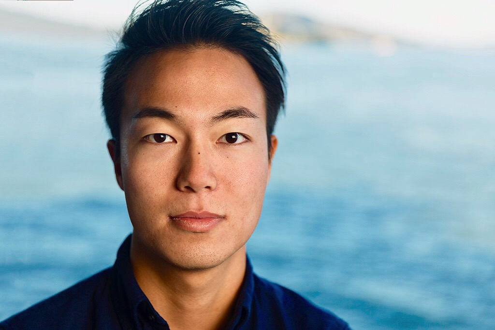

Hi, I'm Sato. I'm the co-founder & CEO of a San Francisco based startup. Previously, I worked at @<a href="http://blog.waygoapp.com/why-evaluating-machine-translation-quality-is-hard/" target="\_blank">waygo</a> as an NLP engineer.
I was born and raised in <a href="https://www.youtube.com/watch?v=Aq2HS2pviD8&t=48s" target="\_blank">Osaka</a>, Japan and moved to San Francisco, California in 2014.

さっそです。シリコンバレーで世界を変えるプロダクトを作るために、英語力・プログラミング経験ゼロで、大学卒業後サンフランシスコに渡りました。渡米してからの3年間はこちらにまとめています。 
<a href="" target="\_blank">『サンフランシスコで創業したスタートアップを解散した話』</a>

 <strong>Satoru Sasozaki / </strong><strong>哘崎　悟</strong> 
<a href="https://twitter.com/satorusasozaki">Twitter</a> / <a href="https://www.linkedin.com/in/satorusasozaki/">LinkedIn</a> / <a href="https://medium.com/@satorusasozaki">Medium</a> / satoru@sasozaki.com

This Jekyll theme is created by <a href="http://chibicode.com/" target="\_blank">Shu Uesugi</a>. Thanks, Shu-San!

 ©2019 Satoru Sasozaki 

