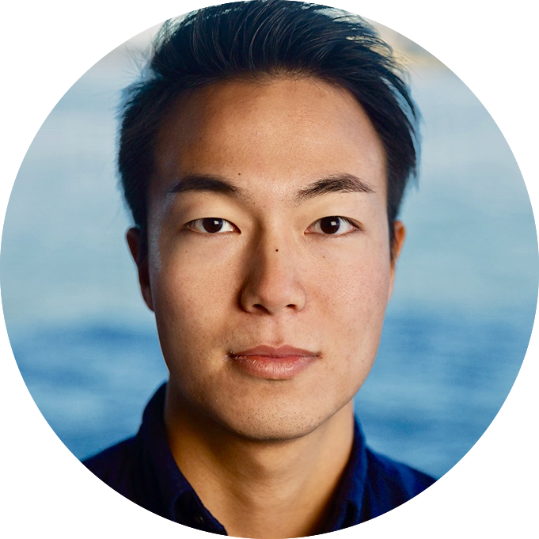

I'm a **CS student** at <a href="http://www.dvc.edu/" target="\_blank">Diablo Valley College</a>, an **NLP engineer intern** at <a href="http://waygoapp.com/" target="\_blank">Waygo</a>, and a freelance **iOS developer** based in the San Francisco Bay Area.　（日本語の自己紹介が下にあります。）
  

### I do

* I make **iOS apps** for fun. Check out <a href="https://medium.com/@satorusasozaki/projects-6ecacfb94be#.fjaqvpqig" target="\_blank">my project page</a>.

* I work as an **NLP engineer** intern at <a href="http://waygoapp.com/" target="\_blank">Waygo</a> working on expanding the machine translation program.

* I use **Swift** / **Objective-C** / **C++** / **Golang** / **Python** / **git** / **vim** / **Jenkins**.

### I teach

* I hosted a course for iOS development for beginners at **Fem Tech UC Berkeley**. <a href="https://medium.com/@satorusasozaki/ios-app-development-workshop-at-femtech-uc-berkeley-f8c303d1067f#.vppnlux9n" target="\_blank"> iOS Development Course at FEMTech UC Berkeley</a> is the written walkthrough.

### I learn

I have completed the following related courses in school:

* Introduction to C++
* Advanced C++
* Object Oriented Programming with C++
* Data Structures and Algorithms with C++
* Linux/Unix Administration
* x86 Assembly Language

### Background

* I was born and raised in **Osaka, Japan**. I graduated from <a href="http://global.kwansei.ac.jp/" target="\_blank">Kwansei Gakuin University</a> with a BA in Linguistics and History.

 * After that, I moved to the Bay Area at the end of 2014 to work as a software engineer in this awesome startup culture.

### On the side

* I draw and do **Paperclip Art** for fun. All my works are on <a href="https://www.behance.net/sasozakisa2463" target="\_blank">Behance</a>.

* I blog on <a href="https://medium.com/@satorusasozaki" target="\_blank">medium</a>.

## Satoru Sasozaki
<a href="mailto:sasozakisatoru@gmail.com">Email</a> /
<a href="https://github.com/satorusasozaki">Github</a> /
<a href="https://www.facebook.com/satoru.sasozaki" target="\_blank">Facebook</a> /
<a href="https://www.linkedin.com/in/satorusasozaki" target="\_blank">Linkedin</a> /
<a href="https://twitter.com/80sla" target="\_blank">Twitter</a>

<!-- -->

## 哘崎　悟 （さそざき さとる）

シリコンバレーのスタートアップで活躍するソフトウェアエンジニアに憧れ、関西学院大学文学部を2014年に卒業後、英語力・プログラミング経験ゼロで、同年暮れにサンフランシスコに渡る。

2年制大学でコンピューターサイエンスを学びながら、<a href="http://500.co/" target="\_blank">500 Startups</a> 出身の機械翻訳系スタートアップ <a href="http://waygoapp.com/" target="\_blank">Waygo</a> に自然言語処理エンジニアインターンとして2016年5月にジョインし、機械学習アルゴリズムの開発を担当している。

開発者向けiOSプログラミングブートキャンプ <a href="https://codepath.com/iosbootcamp" target="\_blank"> CodePath iOS Development Bootcamp for existing developers</a> で出会ったパートナーとレストランレビューサービスを開発中。

大阪市西成区出身。

This Jekyll theme is created by my friend [Shu Uesugi](http://chibicode.com/). Thanks, Shu-San!

😎
